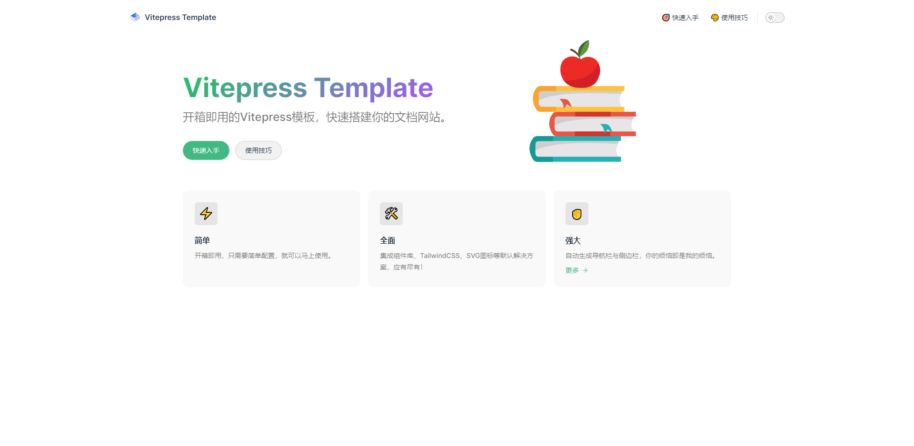

# vitepress-template

vitepress模板

在线演示：[https://vitepress.zhengxiaoping.xyz/](https://vitepress.zhengxiaoping.xyz/)

## 👁️ 预览


# 快速入手

## 🚀 特性

- 默认配置(logo/目录)
- 自动生成导航栏与侧边栏
- 组件库：element-plus
- 原子化CSS：TailwindCSS
- SVG图标（自动拉取iconfont）
- 组件自动注册
- 自定义vite配置
- 全局布局自定义
- 返回顶部
- 图片缩放
- 支持在Chrome中安装应用

## ✈️ 下载并使用

**下载**

```bash
git clone https://github.com/shoppingzh/vitepress-template.git
```

**使用时，请对以下内容进行修改：**

- 修改 `package.json`，重写 `name` / `version` / `description` / `repository` / `author` 等字段
- 打开 `docs/.vitepess/config.ts`，修改：
  - `title`：网站标题
  - `nav` / `sidebar`：导航栏与侧边栏
- 替换 `docs/public/logo.svg` 文件
- 重写 `docs/index.md`，设计自己的首页
- 根据需要删除无用文档，新增自己的文档
- 修改 `docs/public/manifest.webmanifest` 配置

## 升级记录

- 2023-07-07 优化图片插件触发时机
  - 升级vitepress至1.0.0-beta.5版本
  - 优化medium-zoom的触发时机，从路由变化改为调用 `onContentUpdated` 钩子